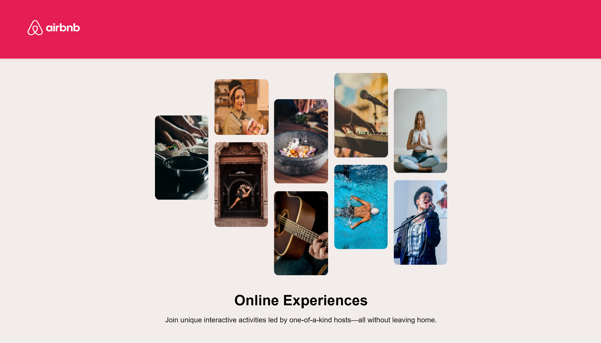

# AirBnb Experiences Clone

An Airbnb clone that I have customised and built using React as part of a course. This gives the user 3 options for activities.

## Table of Contents

- [Features](#features)
- [Technologies Used](#technology)
- [Getting Started](#getting-started)
- [Screenshots](#screenshots)
- [Deployment](#deployment)
- [About Me](#aboutme)
- [License](#license)

## Features

- Airbnb Experiences

## Technologies Used

- HTML
- CSS
- JavaScript
- [React](https://react.dev/)
- [NPM](https://www.npmjs.com/)
- [Google Fonts](https://fonts.google.com/)
- [React Bootstrap](https://react-bootstrap.netlify.app/)

## Getting Started

To get started with the website, follow these steps:

1. Clone this repository to your local machine.

```bash
  git clone https://github.com/DKT15/air-bnb-experiences-clone
```

2. Open the `index.html` file in a web browser.

## Screenshots



## Deployment

The application is deployed and accessible online. Visit the live version [here](https://dkt-air-bnb-experiences-clone.netlify.app/).

## Contributing

If you would like to contribute to this project, please follow these steps:

1. Fork the repository.
2. Create a new branch for your feature or improvement.
3. Make changes and submit a pull request.

## 🚀 About Me

[Danté Kellman-Thompson](https://github.com/DKT15)
